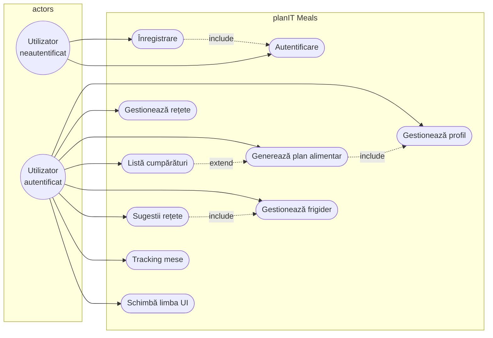
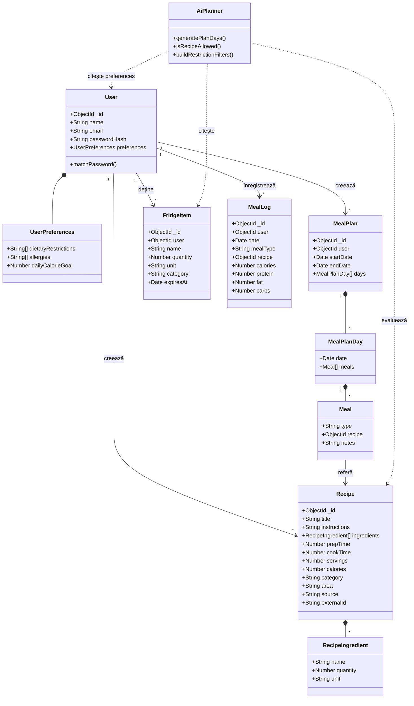
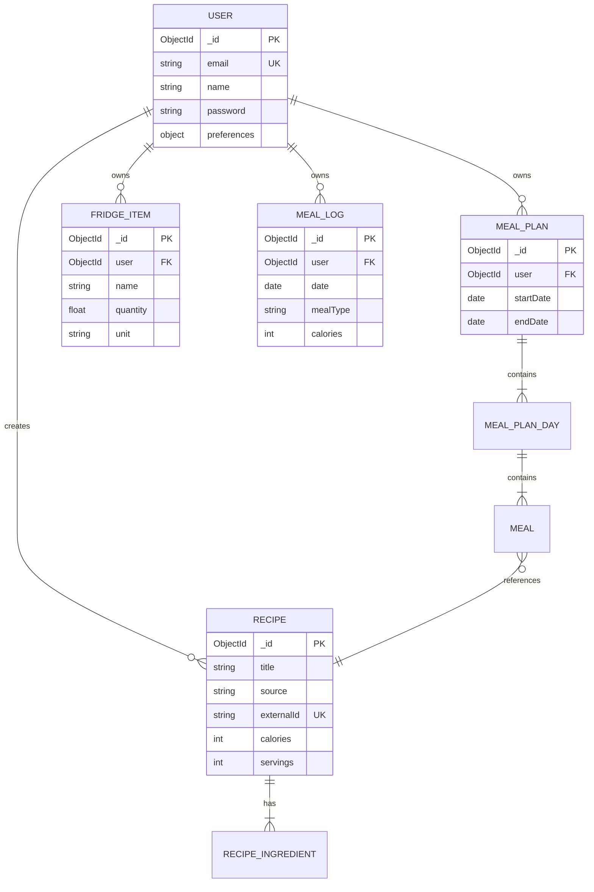
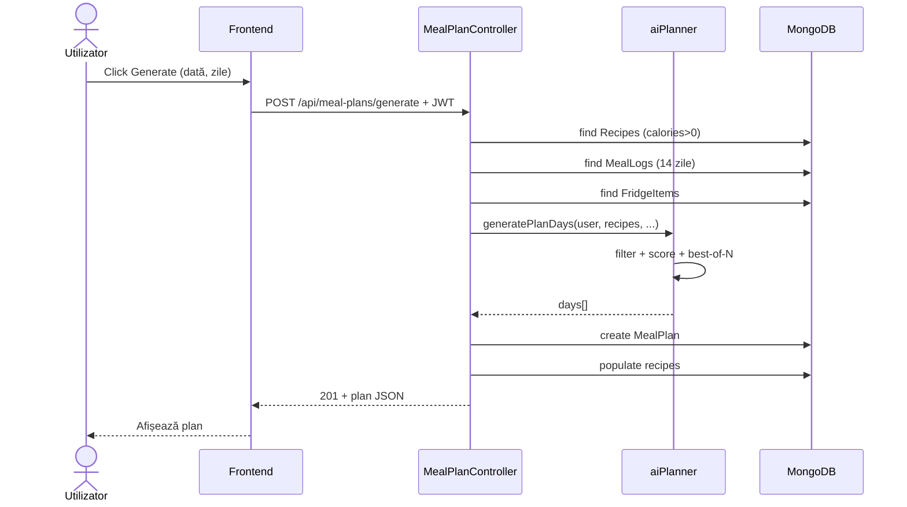
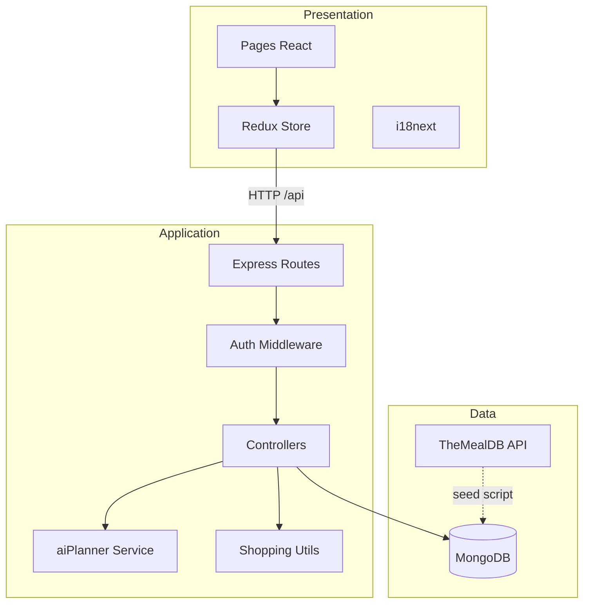
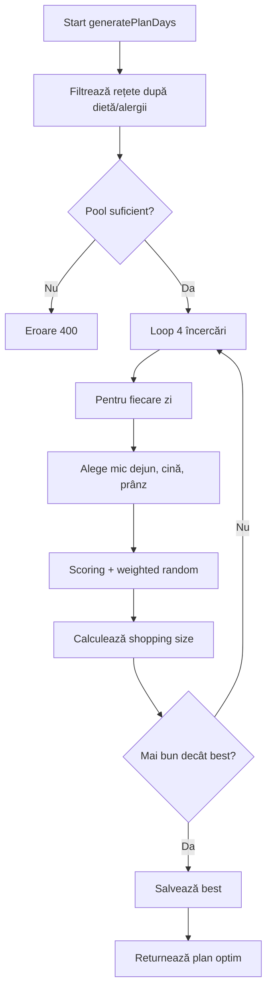

# Anexa B — Diagrame UML și model de date

Documentație standard de proiectare pentru planIT Meals. Diagramele pot fi exportate din Mermaid (VS Code, GitHub) sau redraw în StarUML / draw.io.

---

## B.1 Diagramă cazuri de utilizare (UML)

**Relații:**
- `«include»` Autentificare: toate UC3–UC9 necesită sesiune JWT.
- `«extend»` Listă cumpărături: disponibilă după generare/vizualizare plan.

---

## B.2 Diagramă de clase

---

## B.3 Diagramă entitate–relație (bază de date)

---

## B.4 Diagramă de secvență — generare plan alimentar

---

## B.5 Diagramă de componente (arhitectură)

---

## B.6 Diagramă de activitate — algoritm planificare (simplificat)

