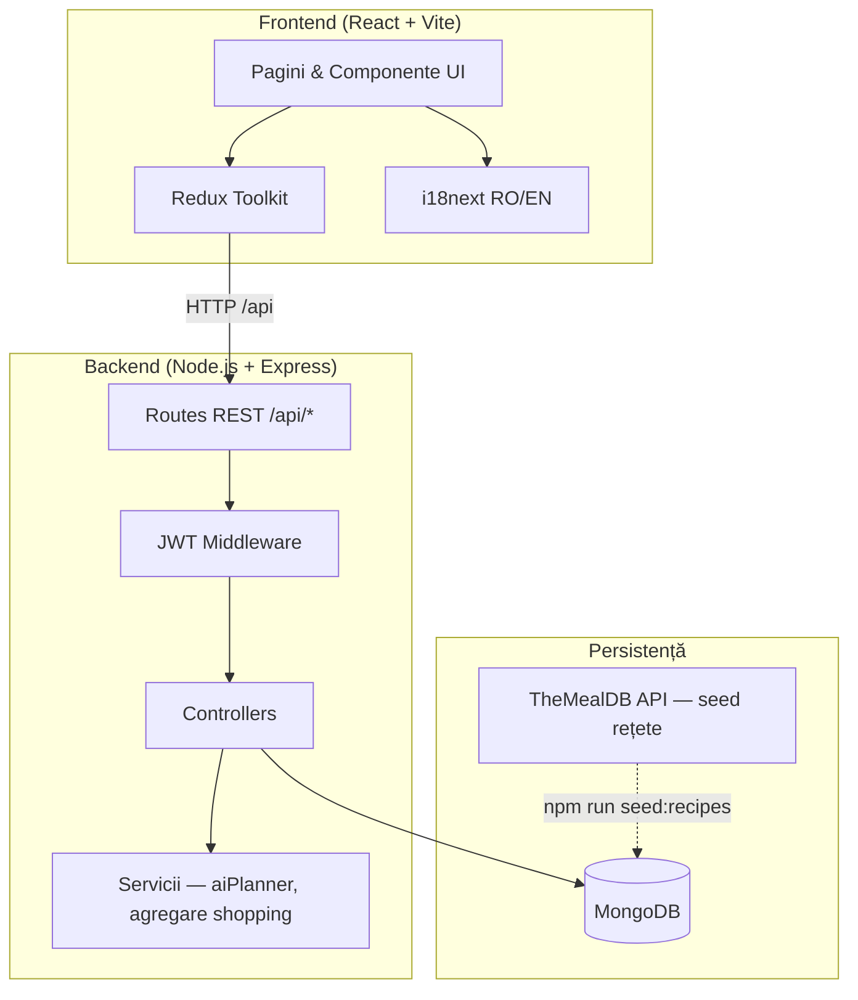
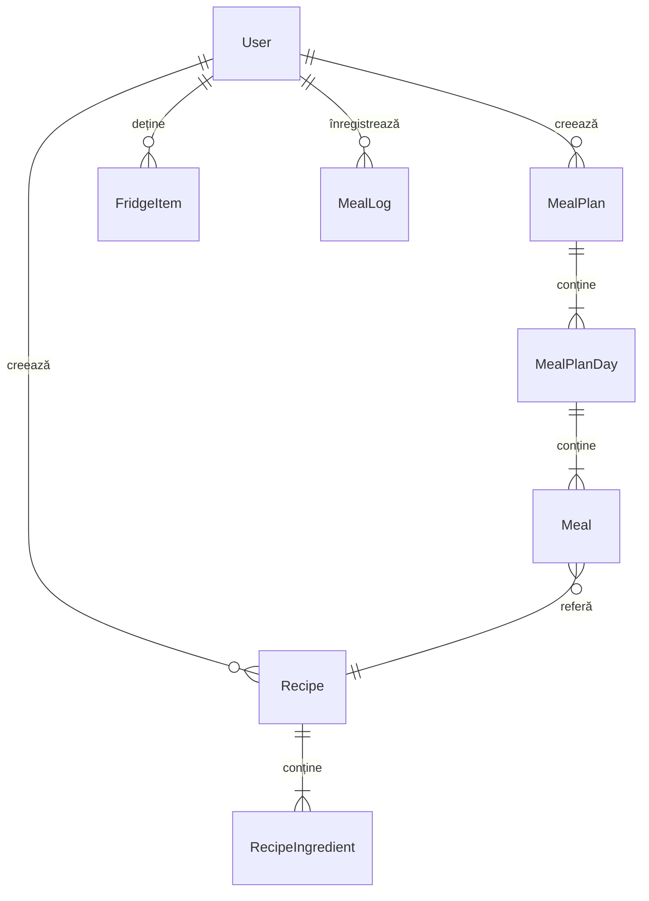
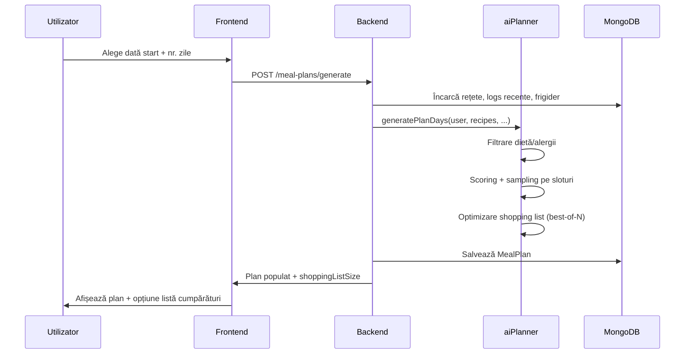

# planIT Meals — Documentație tehnică extinsă

> **Pentru raportul academic de predat (~15–20 pag. cu anexe), folosiți [RAPORT_SEMESTRUL_3.md](./RAPORT_SEMESTRUL_3.md).**  
> Acest fișier rămâne ca referință de implementare detaliată.

**Titlu proiect:** planIT Meals — aplicație web pentru planificarea meselor, gestionarea rețetelor și urmărirea nutrițională  
**Versiune document:** 1.0  
**Data:** aprilie 2026

---

## Cuprins

1. [Consolidarea temei alese](#1-consolidarea-temei-alese)
2. [Proiectarea aplicației](#2-proiectarea-aplicației)
3. [Dezvoltarea soluției tehnice](#3-dezvoltarea-soluției-tehnice)
4. [Integrarea componentelor](#4-integrarea-componentelor)
5. [Pregătirea pentru testare și evaluare](#5-pregătirea-pentru-testare-și-evaluare)
6. [Evaluare preliminară](#6-evaluare-preliminară)
7. [Anexe](#7-anexe)

---

## 1. Consolidarea temei alese

### 1.1 Context și problemă

Planificarea meselor zilnice consumă timp și energie cognitivă, în special pentru persoanele ocupate care doresc să respecte obiective nutriționale, restricții alimentare sau un buget limitat. Deciziile ad-hoc duc la risipă alimentară, cumpărături redundante și dificultăți în respectarea unui regim alimentar consistent.

**planIT Meals** propune o aplicație web integrată care combină:
- un catalog de rețete (inclusiv surse publice seed-uite),
- generarea automată a planurilor alimentare personalizate,
- inventarul digital al frigiderului,
- lista de cumpărături derivată din plan,
- jurnalul zilnic al meselor consumate.

### 1.2 Obiective finale ale proiectului

| # | Obiectiv | Indicator de succes |
|---|----------|---------------------|
| O1 | Reducerea efortului de planificare a meselor | Utilizatorul generează un plan săptămânal (mic dejun, prânz, cină) în < 2 minute |
| O2 | Personalizare după profil nutrițional | Planul respectă restricțiile dietetice, alergiile și ținta calorică zilnică |
| O3 | Optimizarea cumpărăturilor | Lista de cumpărături agregă ingredientele și scade cantitățile acoperite de frigider |
| O4 | Reutilizarea ingredientelor | Plannerul favorizează rețete care folosesc ingrediente deja disponibile sau deja planificate |
| O5 | Urmărirea obiceiurilor alimentare | Utilizatorul înregistrează mesele și compară consumul cu obiectivul zilnic |
| O6 | Interfață accesibilă, bilingvă | UI în română și engleză, responsive, navigare simplă |

### 1.3 Public țintă

- Persoane ocupate (studenți, angajați) care gătesc acasă cel puțin parțial.
- Utilizatori cu restricții alimentare (vegetarian, vegan, fără gluten etc.) sau alergii declarate.
- Utilizatori care doresc control caloric fără aplicații comerciale complexe.

### 1.4 Limitele proiectului (scope)

#### Ce **include** tema

- Aplicație web full-stack (frontend SPA + backend REST API + MongoDB).
- Autentificare utilizatori (JWT), profil cu preferințe dietetice.
- CRUD rețete (utilizator + catalog seed din TheMealDB).
- Generare plan alimentar multi-zi cu algoritm local de planificare („AI planner”).
- Inventar frigider + sugestii de rețete pe baza stocului.
- Listă de cumpărături agregată per plan.
- Jurnal zilnic de mese (tracking calorii și macronutrienți estimați).
- Dashboard cu recomandări contextuale (ora zilei, preferințe).
- Internaționalizare RO/EN.
- Scripturi de seed rețete; suport dev fără Docker (MongoDB in-memory).

#### Ce **nu include** (în afara scope-ului curent)

- Aplicații mobile native (iOS/Android).
- Integrare plăți, livrare mâncare sau supermarket online.
- Recunoaștere foto a alimentelor / scan cod de bare.
- Model ML antrenat pe cloud; recomandări bazate exclusiv pe euristică și scoring local.
- Notificări push, email, calendar extern (Google Calendar etc.).
- Conturi multi-utilizator / partajare plan în familie.
- Validare medicală a planurilor (disclaimer: aplicația nu înlocuiește consultul nutriționist).
- Import automat masiv AllRecipes (blocat pe multe rețele; pregătit ca extensie).

### 1.5 Legătura cu semestrul 2

În semestrul 2 s-au stabilit direcția temei și un prototip inițial. În semestrul 3 s-a consolidat arhitectura, s-au implementat modulele principale (planificator, frigider, tracking, shopping list), s-a rafinat algoritmul de planificare și s-a pregătit cadrul de evaluare cu utilizatori.

---

## 2. Proiectarea aplicației

### 2.1 Arhitectura generală

Aplicația urmează o arhitectură **client–server** cu separare clară între prezentare, logică de business și persistență.



### 2.2 Module principale

| Modul | Responsabilitate | Tehnologii |
|-------|------------------|------------|
| **Autentificare** | Register, login, profil, JWT | Express, bcryptjs, jsonwebtoken |
| **Rețete** | Listare, filtrare, CRUD utilizator, facets | Mongoose, paginare |
| **Plan alimentar** | Generare, listare, ștergere, shopping list | aiPlanner.js, aggregateShoppingMap |
| **Frigider** | Inventar, sugestii match ingrediente | Scoring simplu pe overlap |
| **Tracking** | Jurnal zilnic mese, totaluri macro | MealLog model |
| **Dashboard** | Recomandări, overview plan curent | Redux + heuristici UI |
| **i18n** | Traduceri RO/EN | react-i18next |

### 2.3 Stack tehnologic

| Strat | Tehnologie | Versiune / note |
|-------|------------|-----------------|
| Frontend | React, TypeScript, Vite | Node ≥ 18 |
| State | Redux Toolkit | Async thunks pentru API |
| Routing | React Router v6 | Rute protejate (PrivateRoute) |
| Backend | Node.js, Express | CommonJS, port implicit 5060 |
| ODM | Mongoose | Scheme Recipe, User, MealPlan, etc. |
| Bază de date | MongoDB 7 | Docker sau `USE_MEMORY_MONGO=true` (dev) |
| Auth | JWT Bearer | 7 zile implicit |
| API extern | TheMealDB | Seed ~595 rețete |

### 2.4 Model de date (entități principale)



**User:** name, email, password (hash), preferences (dietaryRestrictions, allergies, dailyCalorieGoal).

**Recipe:** title, ingredients[], prepTime, cookTime, servings, calories, tags, category, area, source (`user` | `seed`), externalId.

**MealPlan:** user, startDate, endDate, days[] cu meals[] (type: breakfast/lunch/dinner/snack, recipe ref).

**FridgeItem:** user, name, quantity, unit, category, expiresAt.

**MealLog:** user, date, mealType, recipe (optional), macros estimate, notes.

### 2.5 API REST (prefix `/api`)

| Resursă | Endpoints principale |
|---------|---------------------|
| Auth | `POST /auth/register`, `POST /auth/login`, `GET/PUT /auth/me` |
| Recipes | `GET /recipes`, `GET /recipes/facets`, `GET/POST/PUT/DELETE /recipes/:id` |
| Meal plans | `GET/POST /meal-plans`, `POST /meal-plans/generate`, `GET /meal-plans/:id/shopping-list` |
| Fridge | `GET/POST /fridge`, `PUT/DELETE /fridge/:id`, `GET /fridge/suggestions` |
| Meal logs | `GET/POST /meal-logs`, `PUT/DELETE /meal-logs/:id` |
| Health | `GET /health` |

Toate rutele (except auth public și health) necesită header `Authorization: Bearer <token>`.

### 2.6 Flux principal: generare plan alimentar



---

## 3. Dezvoltarea soluției tehnice

### 3.1 Autentificare și profil

- **Înregistrare / autentificare** cu email și parolă (min. 6 caractere); parola stocată cu bcrypt.
- **Profil:** nume, email, obiectiv caloric zilnic (implicit 2000 kcal).
- **Restricții dietetice:** vegetarian, vegan, fără gluten, fără lactoză, keto, low-carb, mediterranean.
- **Alergii:** nuci, arahide, ouă, soia, pește, crustacee, susan.
- Preferințele alimentează direct filtrele hard din planificator.

### 3.2 Catalog rețete

- **Sursă seed:** TheMealDB (~595 rețete), `externalId: mealdb_*`, `source: seed`.
- **Rețete utilizator:** CRUD complet; doar autorul poate edita/șterge.
- **Filtrare:** căutare titlu, categorie, zonă geografică, sursă; paginare (limit/skip).
- **Facets:** categorii și zone distincte pentru UI.
- **Estimări nutriționale** pentru rețetele seed (calorii, timp prep/cook) — TheMealDB nu le furnizează.

### 3.3 Planificator inteligent (`aiPlanner.js`)

Algoritm **local**, fără apel LLM extern. Componente:

1. **Filtre hard:** exclude categorii (Dessert, Side pentru slot principal), pattern-uri alergii/restricții, rețete fără calorii/servings valide.
2. **Sloturi zilnice:** mic dejun (~25% calorii), prânz (~40%), cină (~35%) din ținta zilnică.
3. **Scoring ponderat:** potrivire calorică, acoperire ingrediente (frigider + plan), noutate (evită rețete recent logate/planificate), varietate categorie/zonă, timp prep+cook (mai strict în zile lucrătoare), bonus „sănătos”.
4. **Sampling:** top-8 candidați + alegere aleatoare ponderată (variety).
5. **Optimizare listă cumpărături:** generează 4 variante (best-of-N), alege planul cu ~≤25 ingrediente distincte de cumpărat.

### 3.4 Listă de cumpărături

- Agregare pe tot planul: `aggregateShoppingMap.js` + normalizare unități `ingredientShoppingKey.js`.
- Scade cantitățile din frigider; returnează `needed`, `inFridge`, `missing` per ingredient.
- Separă articole deja acoperite (`alreadyCovered`).

### 3.5 Frigider digital

- Adăugare produse (nume, cantitate, unitate, categorie, dată expirare opțională).
- Consolidare automată dacă produsul există (increment cantitate).
- **Sugestii rețete:** sortare după procent ingrediente deținute vs. total rețetă.

### 3.6 Tracking nutrițional

- Jurnal pe zi selectabilă (navigare ±1 zi).
- Adăugare masă: tip (breakfast/lunch/dinner/snack), rețetă sau nume manual, porție, calorii/macros.
- Totaluri zilnice vs. ținte derivate din obiectivul caloric (split estimativ proteină/grăsimi/carbo).
- Istoricul influențează planificatorul (evită rețete consumate recent).

### 3.7 Dashboard

- Salut personalizat, obiectiv caloric, preferințe vizuale (iconițe).
- Recomandare rețetă contextuală (ora zilei → tip masă).
- Acces rapid la plan curent, frigider, tracking.

### 3.8 Interfață utilizator

- Design component-based (`components/ui`: Button, Modal, FormField, etc.).
- Navigare: Navbar + BottomTabs (mobile-first).
- **i18n:** fișiere `translations.ro.json`, `translations.en.json`.
- Modale detaliu rețetă (ingrediente, instrucțiuni, timpi).

### 3.9 Infrastructură de dezvoltare

- `docker-compose.yml` — MongoDB 7 (opțional).
- `USE_MEMORY_MONGO=true` — MongoDB embedded pentru dev fără Docker; auto-seed la primul start.
- `Makefile` — `make dev`, `make mongo-up`, instalare dependențe.
- Proxy Vite: `/api` → `localhost:5060`.

---

## 4. Integrarea componentelor

Integrarea s-a realizat prin:

1. **Contract API tipizat** — interfețe TypeScript în `frontend/src/types` aliniate cu modelele Mongoose.
2. **Redux slices** per domeniu (auth, recipes, mealPlans, fridge, mealLogs) cu thunks async.
3. **Axios interceptors** — injectare JWT, logout la 401.
4. **Flux end-to-end verificat:** register → setare preferințe → populate frigider → generate plan → shopping list → log masă → regenerare plan (evită rețete recente).

**Puncte de cuplaj critice:**
- Preferințele User → `buildRestrictionFilters` în aiPlanner.
- FridgeItem → scoring coverage + shopping list deduction.
- MealLog (14 zile) → `recentLogIds` în generare plan.
- Recipe.calories/servings > 0 → eligibilitate în planificator.

---

## 5. Pregătirea pentru testare și evaluare

### 5.1 Tipuri de testare planificate

| Tip | Scop | Instrument |
|-----|------|------------|
| **Funcțională** | Fiecare feature conform specificației | Scenarii manuale (mai jos) |
| **Integrare** | Flux API + DB | Postman / curl + UI |
| **Usability** | Efort cognitiv, claritate | SUS + task-uri cronometrate |
| **Acceptanță (UAT)** | Utilizatori reali | 5–8 participanți, think-aloud |

### 5.2 Scenarii de test funcțional

| ID | Scenariu | Pași | Rezultat așteptat |
|----|----------|------|-------------------|
| T1 | Înregistrare utilizator nou | Completează formular register | Cont creat, redirect dashboard, token salvat |
| T2 | Setare profil vegan + alergie nuci | Profile → salvează preferințe | Preferințe persistate; plan fără carne/lactate/nuci |
| T3 | Generare plan 7 zile | Meal Plan → dată + 7 → Generate | 201, 7 zile × 3 mese, fără duplicate aceeași zi |
| T4 | Listă cumpărături | Deschide plan → Shopping list | Items cu missing > 0; total rezonabil |
| T5 | Frigider + sugestii | Adaugă 5 ingrediente → Get suggestions | Rețete sortate descrescător după match % |
| T6 | Tracking zilnic | Adaugă prânz din rețetă | Total calorii actualizat vs. obiectiv |
| T7 | CRUD rețetă proprie | Recipes → Create → Edit → Delete | Doar rețetele user pot fi modificate |
| T8 | Schimbare limbă | Toggle RO/EN | Toate etichetele UI traduse |
| T9 | Persistență sesiune | Reîncarcă pagina cu token valid | Rămâne autentificat |
| T10 | Token expirat | Șterge token / așteaptă expirare | Redirect login, mesaj clar |

### 5.3 Recrutarea utilizatorilor pentru evaluare

**Criterii incluziune:**
- Vârstă 18+, gătește acasă cel puțin 3 ori/săptămână.
- Dispune de laptop/telefon cu browser modern.

**Criterii excludere:**
- Nutriționiști profesioniști (bias expert).
- Participanți implicați direct în dezvoltarea aplicației.

**Profil țintă (mix):**
- 2 studenți cu timp limitat,
- 2 angajați full-time,
- 1–2 persoane cu restricții alimentare declarate,
- 1 utilizator fără experiență cu meal planners.

**Procedură:**
1. Consimțământ informat (GDPR, date anonimizate).
2. Sesiune 30–45 min: 4 task-uri + chestionar SUS.
3. Interviu scurt (5 întrebări deschise).

### 5.4 Task-uri pentru evaluare usability

| Task | Instrucțiune dată participantului | Metrică |
|------|-----------------------------------|---------|
| U1 | „Creează un cont și setează obiectivul caloric la 1800 kcal.” | Timp, erori |
| U2 | „Generează un plan pentru 5 zile începând de luni.” | Timp, succes |
| U3 | „Adaugă în frigider ouă, lapte și pâine; găsește o rețetă potrivită.” | Timp, satisfacție (1–5) |
| U4 | „Înregistrează ce ai mâncat azi la prânz.” | Timp, succes |

**Chestionar post-sesiune (exemple):**
- Cât de ușor a fost să generezi planul? (Likert 1–5)
- Ai avea încredere să folosești lista de cumpărături la magazin? (Da/Nu/Parțial)
- Ce ai schimba prima dată?

### 5.5 Criterii de acceptanță (release MVP)

- [ ] Toate scenariile T1–T10 trec fără erori critice.
- [ ] Generare plan reușește cu catalog seed complet.
- [ ] Zero vulnerabilități evidente (parole hash, rute protejate).
- [ ] Medie SUS ≥ 68 (benchmark industrie) sau îmbunătățire vs. evaluarea S2.

---

## 6. Evaluare preliminară

### 6.1 Auto-evaluare tehnică (dezvoltare)

| Criteriu | Status | Observații |
|----------|--------|------------|
| Arhitectură modulară | ✓ | Separare controllers / services / models |
| Funcționalități core implementate | ✓ | Auth, recipes, plan, fridge, tracking, shopping |
| Personalizare dietă | ✓ | 7 restricții + 7 alergii în planner |
| Date seed | ✓ | ~595 rețete TheMealDB |
| i18n | ✓ | RO + EN |
| Dev experience | ✓ | Memory Mongo, Makefile, kill-ports |
| Teste automate | ◐ | Planificate; încă predominant testare manuală |
| Evaluare utilizatori | ◐ | Protocol definit; sesiuni de recrutat |

### 6.2 Limitări cunoscute

- Caloriile rețetelor seed sunt **estimate**, nu analizate nutrițional.
- Matching ingrediente frigider ↔ rețetă este **euristic** (substring, normalizare text).
- MongoDB in-memory **resetează datele** la repornire server.
- Import AllRecipes depinde de acces rețea / ToS site sursă.

### 6.3 Direcții de rafinare (post-evaluare)

- Teste unitare pentru `aiPlanner` și `aggregateShoppingMap`.
- Persistență MongoDB în producție (Docker/Atlas).
- Îmbunătățire UX erori API (toast-uri consistente).
- Export listă cumpărături (PDF / share).
- Refinare algoritm după feedback utilizatori (ponderi scoring).

---

## 7. Anexe

### 7.1 Pornire aplicație (dezvoltare)

```bash
# Node 20
nvm use

# Backend
cd backend
cp .env.example .env   # USE_MEMORY_MONGO=true pentru dev fără Docker
npm install
npm run dev:clean      # eliberează porturi + nodemon

# Frontend (terminal separat)
cd frontend
npm install
npm start
```

- UI: http://localhost:5173  
- API: http://localhost:5060/api/health  

### 7.2 Structură repository

```
planIT-meals/
├── backend/          # Express API, modele, servicii
│   └── src/
│       ├── controllers/
│       ├── models/
│       ├── routes/
│       ├── services/aiPlanner.js
│       └── utils/
├── frontend/         # React SPA
│   └── src/
│       ├── pages/
│       ├── store/slices/
│       └── i18n/
├── docs/             # Documentație academică
├── docker-compose.yml
└── Makefile
```

### 7.3 Referințe

- TheMealDB API: https://www.themealdb.com/api.php  
- Mongoose Documentation: https://mongoosejs.com  
- React / Redux Toolkit: documentație oficială  

---

*Document pregătit pentru livrabilele Semestrului 3 — Consolidare temă, proiectare, implementare, pregătire testare.*
