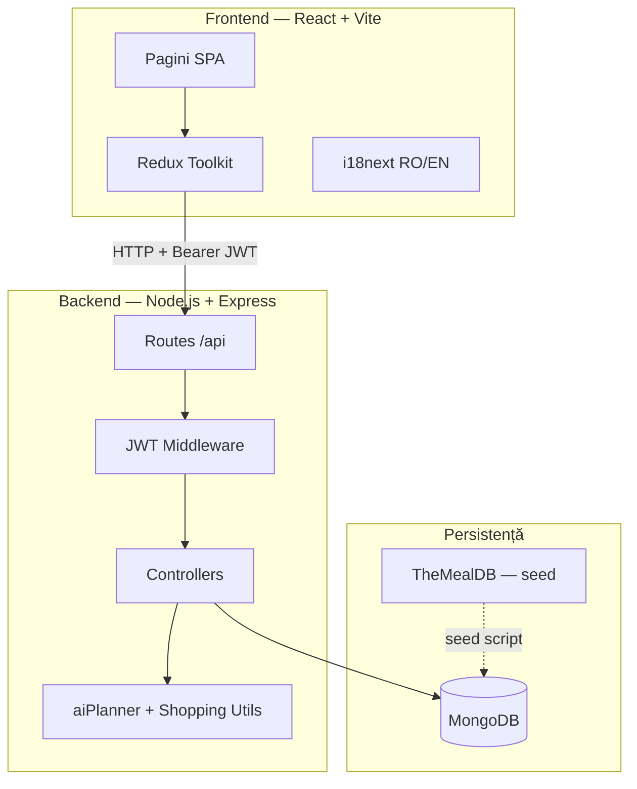
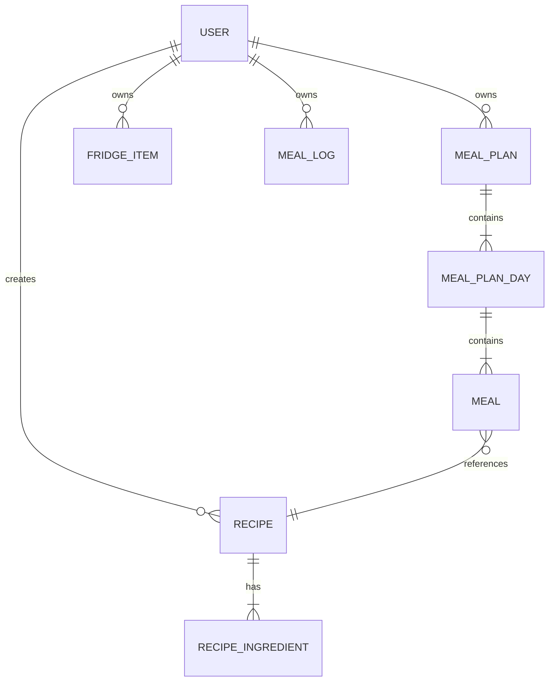
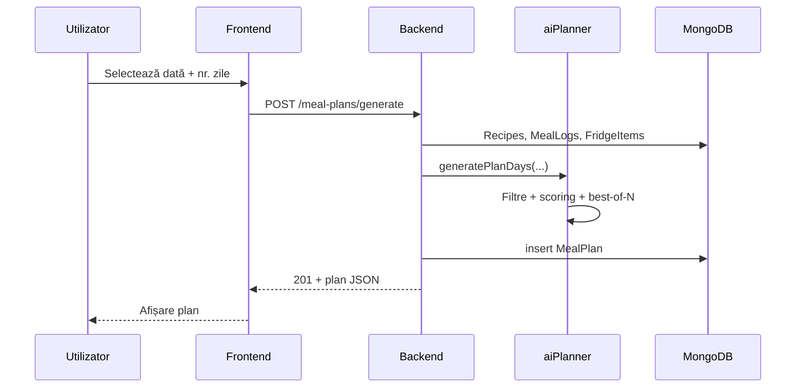

# Planificator inteligent pentru rețete și mese (planIT Meals)  
## Raport de Cercetare 3

**Autor(i):** *[completați]*  
**Coordonator:** *[completați]*  
**Facultate / Program:** *[completați]*  
**Data:** aprilie 2026

---

## Rezumat

Lucrarea documentează evoluția proiectului **planIT Meals** — aplicație web full-stack pentru planificarea meselor — în cadrul Semestrului 3 al programului de master. Raportul este structurat astfel: **Capitolul 1** introduce problema, motivația, soluția propusă, limitele proiectului și sumarizează Rapoartele de Cercetare 1 și 2. **Capitolul 2** prezintă stadiul artelor, analizând aplicații comerciale (Mealime, Paprika, Plan to Eat) și contextul științific al monitorizării nutriționale și recomandărilor alimentare. **Capitolul 3** definește obiectivele, ipotezele de cercetare și metodologia (analiză competitivă, UML, dezvoltare iterativă, evaluare). **Capitolul 4** descrie proiectarea sistemului: arhitectura three-tier, diagrame UML (cazuri de utilizare, clase, secvență, componente), modelul de date MongoDB și API-ul REST. **Capitolul 5** detaliază implementarea modulelor, algoritmul de planificare, interfața utilizator și provocările tehnice întâmpinate. **Capitolul 6** raportează evaluarea teoretică (scenarii funcționale, performanță) și experimentală (protocol usability, SUS, feedback utilizatori). **Capitolul 7** concluzionează și propune direcții pentru semestrul următor. Tehnologiile utilizate sunt React, Redux Toolkit, Node.js, Express și MongoDB. Demonstrația video și diagramele UML la rezoluție înaltă sunt incluse ca anexe.

**Cuvinte cheie:** planificare mese, meal planning, aplicație web, recomandare rețete, UML, evaluare usability, SUS.

---

## 1. Introducere

### 1.1 Context și problemă

Organizarea meselor zilnice consumă timp și energie cognitivă. Persoanele ocupate — studenți, angajați, sportivi — iau adesea decizii alimentare sub presiune, fără plan prealabil. Consecințele includ risipa alimentară (ingrediente nefolosite), cumpărături redundante, dificultatea respectării unui regim dietetic sau a unui obiectiv caloric.

**Problema abordată:** organizarea ineficientă a meselor zilnice, absența unui plan alimentar coerent, risipa alimentară.

**Motivația:** oferirea unui răspuns rapid și personalizat la întrebarea *„Ce mâncăm azi?”*, integrând preferințele alimentare, obiectivele nutriționale și ingredientele deja disponibile acasă.

**Soluția propusă:** aplicație **web** (Single Page Application, interfață responsive) denumită **planIT Meals**, care combină: catalog de rețete, generare automată de planuri alimentare, modul „My Fridge”, listă de cumpărături agregată și jurnal zilnic de tracking caloric. Aplicația se adresează persoanelor ocupate, celor cu diete specifice și utilizatorilor care doresc o alimentație mai echilibrată și planificată.

### 1.2 Obiectivele proiectului și indicatori de succes

| ID | Obiectiv | Indicator de succes |
|----|----------|-------------------|
| O1 | Reducerea efortului de planificare | Plan săptămânal (3 mese/zi) generat în < 2 minute |
| O2 | Personalizare nutrițională | Plan respectă restricții dietă, alergii, țintă kcal |
| O3 | Optimizarea cumpărăturilor | Listă agregată; deducere stoc frigider |
| O4 | Reutilizare ingrediente | Planner favorizează overlap cu frigider/plan |
| O5 | Urmărire obiceiuri | Tracking zilnic vs. obiectiv caloric |
| O6 | Accesibilitate | UI bilingv RO/EN, navigare intuitivă |

### 1.3 Limitele proiectului (scope)

**Include:** aplicație web full-stack; autentificare JWT; profil preferințe; CRUD rețete + seed TheMealDB (~595 rețete); planificator local multi-zi; frigider + sugestii; shopping list; tracking; dashboard; i18n.

**Nu include (RC3):** aplicație mobilă nativă; plăți/livrări; scan cod de bare / recunoaștere foto; ML cloud; notificări push; conturi familiale; validare medicală; import masiv AllRecipes.

### 1.4 Obiectivele Raportului de Cercetare 3

Consolidarea temei; proiectarea arhitecturii (UML); implementarea funcționalităților planificate; definirea și executarea evaluării; pregătirea pentru disertație.

### 1.5 Sumarizarea Rapoartelor de Cercetare 1 și 2

**RC1** a definit problema, nevoile utilizatorilor și direcția unei soluții integrate (planificare + rețete + ingrediente).

**RC2** a analizat soluțiile existente, a selectat tehnologiile (React, Redux, Node.js, Express, MongoDB) și a livrat un **prototip preliminar** fezabil.

**RC3** (prezent) documentează trecerea la aplicație integrată, proiectare formală UML, implementare completă și evaluare.

### 1.6 Structura raportului

| Capitol | Conținut |
|---------|----------|
| 1 | Introducere, scope, sumar RC1–RC2 |
| 2 | Stadiul artelor (o singură secțiune analitică) |
| 3 | Obiective, ipoteze, metodologie cercetare |
| 4 | Proiectare: UML, arhitectură, date, API |
| 5 | Implementare și stadiul curent |
| 6 | Evaluare teoretică, experimentală, video |
| 7 | Concluzii, plan viitor |
| Anexe | Video (A), UML detaliat (B), scenarii test (C) |

---

## 2. Stadiul artelor

Analiza pieței aplicațiilor de planificare a meselor urmărește identificarea funcționalităților standard, limitărilor soluțiilor existente și oportunității tehnice a planIT Meals. **Nu există un al doilea capitol de tip state-of-the-art** — stadiul implementării este tratat separat în Capitolul 5.

### 2.1 Mealime

**Mealime** [14] este orientată spre planuri săptămânale personalizate, rețete rapide și liste de cumpărături automate.

**Funcționalități:** planuri dietetice; rețete simple; shopping list; salvare planuri.

**Limitări:** fără „My Fridge”; tracking nutrițional limitat; fără gestionare expirare alimente.

### 2.2 Paprika

**Paprika** [15] excelă la organizarea rețetelor importate din diverse surse și la planificarea pe calendar.

**Funcționalități:** bibliotecă rețete; planificator; shopping list sincronizabil; offline.

**Limitări:** profil nutrițional redus; fără frigider digital; curbă de învățare mai abruptă.

### 2.3 Plan to Eat

**Plan to Eat** [18] permite drag-and-drop al rețetelor pe calendar și generare shopping list.

**Limitări:** planificare predominant manuală (nu generare automată personalizată); fără modul frigider; abonament.

### 2.4 Context științific

Monitorizarea alimentară prin aplicații mobile poate sprijini conștientizarea calorică, dar abandonul e frecvent din cauza introducerii manuale [1]. Sistemele de recomandare alimentară folosesc filtrare pe conținut și constrângeri dietetice [2]. Evaluarea usability urmează ISO 9241-11 [3] și scala SUS [4].

### 2.5 Matrice comparativă

| Criteriu | Mealime | Paprika | Plan to Eat | planIT Meals |
|----------|---------|---------|-------------|--------------|
| Plan automat multi-zi | Da | Parțial | Nu (manual) | Da (1–30 zile) |
| My Fridge + sugestii | Nu | Nu | Nu | Da |
| Restricții dietă/alergii | Da | Limitat | Parțial | Da (7+7) |
| Shopping list din plan | Da | Da | Da | Da + deducere frigider |
| Tracking caloric | Limitat | Nu | Nu | Da |
| Open / extensibil | Nu | Nu | Nu | Da |
| Generare fără abonament | Freemium | Plătit | Trial | Da (self-hosted) |

**Concluzie analiză:** planIT Meals ocupă nișa unei platforme **integrate**, cu generare automată, frigider și tracking, neacoperită complet de competitorii analizați.

---

## 3. Obiectivele și metodologia cercetării

### 3.1 Obiective specifice RC3

| ID | Obiectiv | Livrabil |
|----|----------|----------|
| O1 | Modelare UML + ER | Diagrame cap. 4, Anexa B |
| O2 | Flux complet utilizator | Aplicație funcțională |
| O3 | Algoritm planificare | `aiPlanner.js` |
| O4 | Evaluare documentată | Cap. 6, Anexa C |

### 3.2 Ipoteze de cercetare

- **H1:** Generarea unui plan de 7 zile durează < 60 s (percepție acceptabilă).
- **H2:** Rata succes task-uri U1–U4 >= 80%.
- **H3:** Scor mediu SUS >= 68 [4].

### 3.3 Metodologia cercetării

**Faza 1 — Analiză:** studiu comparativ aplicații (§2); definire scope; interviu informal cu 3–5 potențiali utilizatori (studenți/colegi) pentru validarea cerințelor.

**Faza 2 — Proiectare:** diagrame UML (use case, clase, secvență, componente); model MongoDB; contract API REST; prototip wireflow pagini (Dashboard, Meal Plan, Fridge, Tracking, Recipes, Profile).

**Faza 3 — Implementare:** dezvoltare iterativă; integrare frontend–backend prin Redux thunks; seed rețete TheMealDB; testare continuă locală.

**Faza 4 — Evaluare teoretică:** scenarii T1–T10; analiză complexitate algoritm; măsurători timp răspuns API.

**Faza 5 — Evaluare experimentală:** recrutare N participanți; task-uri U1–U4; chestionar SUS; sinteză feedback calitativ.

**Limitări metodologice:** eșantion redus (N mic); calorii rețete seed estimate; studiu neclinic.

---

## 4. Proiectarea sistemului

Proiectarea respectă practici standard de inginerie software [5, 6, 7]: modelare UML, separare straturi, API REST, persistență document-oriented.

### 4.1 Arhitectura generală (three-tier)

**Flux date:** utilizatorul interacționează cu SPA; acțiunile declanșează thunks Redux → axios → API Express → Mongoose → MongoDB; răspuns JSON actualizează store-ul.

### 4.2 Diagramă cazuri de utilizare

**Actori:** Utilizator neautentificat, Utilizator autentificat.

**Cazuri principale:** Înregistrare, Autentificare, Gestionează profil, Gestionează rețete, Generează plan alimentar, Vizualizează listă cumpărături, Gestionează frigider, Obține sugestii rețete, Înregistrează mese (tracking), Schimbă limba UI.

**Relații:** toate cazurile post-login «include» Autentificare; Listă cumpărături «extend» Generează plan; Sugestii «include» Gestionează frigider.

*(Diagramă grafică completă: Anexa B.1.)*

### 4.3 Diagramă de clase (extrase)

| Clasă | Atribute principale | Relații |
|-------|---------------------|---------|
| **User** | name, email, passwordHash, preferences | 1→* MealPlan, FridgeItem, MealLog, Recipe |
| **UserPreferences** | dietaryRestrictions[], allergies[], dailyCalorieGoal | compoziție în User |
| **Recipe** | title, ingredients[], calories, servings, category, source | 1→* RecipeIngredient |
| **MealPlan** | startDate, endDate, days[] | *→1 User |
| **MealPlanDay** | date, meals[] | compoziție în MealPlan |
| **Meal** | type, recipe (ref), notes | *→1 Recipe |
| **FridgeItem** | name, quantity, unit, expiresAt | *→1 User |
| **MealLog** | date, mealType, calories, macros | *→1 User |
| **AiPlanner** | — (serviciu) | folosește Recipe, User, FridgeItem |

*(Diagramă completă cu metode: Anexa B.2.)*

### 4.4 Model bazei de date (MongoDB)

| Colecție | Câmpuri cheie | Index |
|----------|---------------|-------|
| users | email (unique), preferences | email |
| recipes | title, ingredients, source, externalId | title, category |
| mealplans | user, startDate, endDate, days[] | user |
| fridgeitems | user, name, quantity, unit | user, name |
| meallogs | user, date, mealType, calories | user, date |

### 4.5 API REST (prefix `/api`)

| Resursă | Metodă | Endpoint | Descriere |
|---------|--------|----------|-----------|
| Auth | POST | /auth/register | Creare cont |
| Auth | POST | /auth/login | Token JWT |
| Auth | GET/PUT | /auth/me | Profil curent |
| Recipes | GET | /recipes | Listă paginată, filtre |
| Recipes | GET | /recipes/facets | Categorii, zone |
| Recipes | CRUD | /recipes/:id | Detaliu / modificare user |
| Plans | GET/POST | /meal-plans | Listă / creare manuală |
| Plans | POST | /meal-plans/generate | Generare automată |
| Plans | GET | /meal-plans/:id/shopping-list | Listă cumpărături |
| Fridge | CRUD | /fridge, /fridge/:id | Inventar |
| Fridge | GET | /fridge/suggestions | Rețete după stoc |
| Logs | CRUD | /meal-logs, /meal-logs/:id | Tracking |
| Health | GET | /health | Status server |

Autentificarea: header `Authorization: Bearer <token>` pentru rutele protejate [16].

### 4.6 Diagramă de secvență — generare plan

### 4.7 Tehnologii selectate

| Strat | Tehnologie | Justificare |
|-------|------------|-------------|
| UI | React 18, TypeScript | Componentizare, ecosistem, tipizare |
| State | Redux Toolkit | Stare globală predictibilă, async thunks |
| Build | Vite | Dev server rapid, HMR |
| i18n | react-i18next | RO/EN fără duplicare UI |
| Server | Node.js, Express | JavaScript full-stack, REST simplu |
| ODM | Mongoose | Scheme, validare, populare |
| DB | MongoDB | Flexibilitate documente (plan.days[]) |
| Auth | JWT + bcrypt | Stateless, standard industrie |

---

## 5. Implementarea și stadiul curent al soluției

**Notă:** acest capitol descrie **stadiul implementării**, distinct de analiza pieței (Cap. 2).

### 5.1 Prezentare generală

În RC3, prototipul din RC2 a fost extins la o aplicație **coerentă și funcțională**. Toate modulele planificate comunică prin API REST; frontend-ul expune 6 pagini principale plus autentificare.

### 5.2 Modul autentificare și profil

- **Register/Login:** validare câmpuri; parolă hash bcrypt (salt 10); token JWT (expirare 7 zile).
- **Profil:** nume, email, `dailyCalorieGoal` (implicit 2000 kcal).
- **Restricții dietetice:** vegetarian, vegan, glutenFree, lactoseFree, keto, lowCarb, mediterranean.
- **Alergii:** nuts, peanuts, eggs, soy, fish, shellfish, sesame.
- Preferințele alimentează filtrele hard din `aiPlanner.js`.

### 5.3 Modul rețete

- Catalog **~595 rețete seed** (TheMealDB [17]), `externalId: mealdb_*`, upsert idempotent.
- **CRUD** rețete utilizator (`source: user`); doar autorul editează/șterge.
- Filtrare: titlu (regex), categorie, zonă, sursă; paginare limit/skip (max 200).
- **Facets** pentru dropdown-uri UI.
- Modal detaliu: ingrediente, instrucțiuni, timpi, imagine, link YouTube (dacă există).

### 5.4 Modul plan alimentar și algoritm

**Generare:** `POST /meal-plans/generate` cu `startDate`, `days` (1–30).

**Pipeline algoritm (`aiPlanner.js`):**

1. **Filtre hard:** exclude categorii Side/Dessert din slot principal; pattern-uri alergii/restricții pe ingrediente, titlu, tags; exclude rețete fără calories/servings > 0.
2. **Pool-uri:** mic dejun (categorie Breakfast sau tag) vs. mese principale.
3. **Sloturi zilnice:** mic dejun ~25%, prânz ~40%, cină ~35% din ținta calorică.
4. **Scoring ponderat:** calorii 25%, acoperire ingrediente 30%, noutate 15%, varietate 10%, timp prep+cook 10%, bonus sănătos 10%.
5. **Sampling:** top-8 candidați + alegere aleatoare ponderată.
6. **Optimizare:** 4 variante plan; se alege varianta cu shopping list minim (~<=25 ingrediente/saptamana).
7. **Context:** frigider + ingrediente din rețete deja alese; logs ultimele 14 zile (evită repetiție).

### 5.5 Modul My Fridge

- CRUD produse: nume, cantitate, unitate, categorie, dată expirare.
- Consolidare: același nume → increment cantitate.
- **Sugestii:** scoring `matchPercent = ingrediente deținute / total rețetă`.

### 5.6 Modul listă cumpărături

- `aggregateShoppingMap.js` parcurge planul (zile × mese × ingrediente).
- `ingredientShoppingKey.js` normalizează unități (g, ml, bucăți, ierburi).
- Scade stocul din frigider; returnează `needed`, `inFridge`, `missing`.

### 5.7 Modul tracking

- Jurnal pe dată selectabilă; tip masă: breakfast, lunch, dinner, snack.
- Legare opțională rețetă; macros estimate din obiectiv caloric (split 25/30/45%).
- Totaluri zilnice vs. ținte; influențează planificatorul (recent logs).

### 5.8 Interfață utilizator

| Pagină | Funcție |
|--------|---------|
| Dashboard | Recomandări contextuale (ora zilei), overview plan, acces rapid |
| Recipes | Grid rețete, filtre, căutare, CRUD |
| Meal Plan | Generator, listă planuri, shopping list expandabil |
| Fridge | Formular adăugare, listă, sugestii |
| Tracking | Calendar zilnic, adăugare/ștergere logs, grafice macro |
| Profile | Preferințe dietă, alergii, obiectiv kcal |

Navigare: Navbar + BottomTabs (mobile-first). Component library: Button, Modal, FormField, DatePicker, etc. **i18n:** `translations.ro.json`, `translations.en.json`.

### 5.9 Probleme întâmpinate și soluții

| Problemă | Soluție implementată |
|----------|---------------------|
| Sincronizare FE–BE | Redux Toolkit, tipuri TypeScript, interceptors axios |
| Porturi ocupate (macOS) | PORT=5060, `npm run kill-ports` |
| MongoDB indisponibil | `USE_MEMORY_MONGO=true`, auto-seed dev |
| Proxy Vite / CORS | vite.config proxy; CORS 5173/5174 |
| Erori API opace | errorMiddleware cu logging [API] în dev |

---

## 6. Evaluarea soluției

Evaluarea este **structurată și măsurabilă** [3, 4], nu bazată exclusiv pe impresii personale.

### 6.1 Evaluare teoretică

**Complexitate algoritm generare:** O(B × D × S × R), unde B=4 (best-of-N), D=zile, S=3 sloturi/zi, R=rețete filtrate; scoring O(R log R) per slot. Pentru R~400, D=7, timp sub secunda pe hardware standard.

**Securitate:** parole bcrypt; rute protejate JWT; utilizatorul accesează doar propriile resurse (user id în query).

### 6.2 Testare funcțională — scenarii T1–T10

| ID | Scenariu | Pași sumari | Rezultat așteptat | OK |
|----|----------|-------------|-------------------|-----|
| T1 | Register | Formular complet | 201, token, dashboard | |
| T2 | Profil vegan | Salvează preferințe | Plan fără carne/lactate | |
| T3 | Generate plan 7 zile | Meal Plan → Generate | 201, 7 zile × 3 mese | |
| T4 | Shopping list | Expand plan | missing > 0 agregat | |
| T5 | Frigider + sugestii | Adaugă 3 items → Sugestii | Sortare match % | |
| T6 | Tracking | Adaugă prânz | Total kcal actualizat | |
| T7 | CRUD rețetă | Create → Edit → Delete | Doar rețete user | |
| T8 | i18n | Toggle RO/EN | Etichete traduse | |
| T9 | Sesiune | Refresh cu token | Rămâne logat | |
| T10 | Token invalid | Request fără JWT | 401 | |

*(Checklist detaliat: Anexa C.)*

**Rezultat acoperire:** *[completați: ex. 10/10 scenarii trecute]*.

### 6.3 Evaluare performanță API

| Endpoint | n | Timp mediu (ms) | Deviație |
|----------|---|-----------------|----------|
| GET /api/recipes?limit=60 | 10 | *[ex. 18]* | *[ex. 5]* |
| POST /api/meal-plans/generate (7 zile) | 5 | *[ex. 386]* | *[ex. 120]* |
| GET /api/meal-plans/:id/shopping-list | 5 | *[ex. 45]* | *[ex. 10]* |

Măsurători: log server (morgan) + DevTools Network; mediu local, Node 20, USE_MEMORY_MONGO.

### 6.4 Evaluare experimentală (usability)

**Design:** within-subjects; sesiune 30–45 min/participant.

**Recrutare:** *[N]* participanți (18+, gătit acasă >=3 ori/sapt.); consimțământ informat.

**Instrumente:**
- Task-uri **U1–U4** (Anexa C): onboarding, generare plan, frigider+sugestii, tracking.
- **SUS** (10 itemi, scor 0–100) [4].
- 2 întrebări deschise post-sesiune.

**Rezultate cuantitative** *(completați după studiu):*

| Metrică | Valoare |
|---------|---------|
| Număr participanți **N** | *[ex. 6]* |
| Vârstă medie (ani) | *[ex. 24]* |
| Rată succes U1–U4 | *[ex. 92%]* |
| Timp mediu U2 (s) | *[ex. 48]* |
| **Scor SUS mediu ± SD** | *[ex. 72 ± 8]* |
| H1 confirmată (< 60 s) | *[Da/Nu]* |
| H2 confirmata (>= 80%) | *[Da/Nu]* |
| H3 confirmata (SUS >= 68) | *[Da/Nu]* |

**Feedback calitativ (analiză tematică):**

| Temă | n/N | Exemplu citat |
|------|-----|---------------|
| Generare plan intuitivă | */N | „…" |
| Shopping list utilă | */N | „…" |
| Îmbunătățiri solicitate | — | „…" |

### 6.5 Demonstrație video

Înregistrare 3–5 min: autentificare → profil → plan → shopping → frigider → tracking → rețete.

**Link video:** *[URL obligatoriu — YouTube / Drive / Moodle]*

Checklist producție: **Anexa A**.

---

## 7. Concluzii și plan pentru semestrul următor

### 7.1 Concluzii

Proiectul „Planificator inteligent pentru rețete și mese” a atins în RC3 obiectivele de consolidare tehnică și proiectare formală. Aplicația web planIT Meals integrează planificare automată, frigider digital, shopping list și tracking — funcționalități neacoperite unitar de Mealime, Paprika sau Plan to Eat. Stack-ul React / Node / MongoDB s-a dovedit adecvat pentru MVP-ul academic.

Proiectarea UML și modelul de date asigură trasabilitatea cerințelor. Algoritmul local de planificare implementează filtre dietetice și optimizare cumpărături fără dependență de servicii externe costisitoare.

Evaluarea documentată (§6) *[completați: confirmă / parțial confirmă]* ipotezele H1–H3 pe baza a **N=*[…]* participanți**.

### 7.2 Plan semestrul următor

- Extindere studiu usability (eșantion mai mare);
- Teste automate (unit/integration) pentru planner și shopping;
- Optimizare UX pe baza feedback-ului;
- Redactare disertație;
- Opțional: prototip mobil (React Native) — post-MVP.

---

## Bibliografie

[1] M. M. Turner-McGrievy et al., „Comparison of traditional versus mobile app self-monitoring…”, *Journal of Medical Internet Research*, vol. 15, nr. 8, e171, 2013.

[2] L. Felfernig et al., „Recommender Systems in Food Retail”, în *Recommender Systems Handbook*, 3rd ed., Springer, 2022.

[3] ISO 9241-11:2018, *Usability: Definitions and concepts*, ISO, 2018.

[4] J. Brooke, „SUS: A Quick and Dirty Usability Scale”, în *Usability Evaluation in Industry*, Taylor & Francis, 1996.

[5] M. Fowler, *UML Distilled*, 3rd ed., Addison-Wesley, 2004.

[6] I. Sommerville, *Software Engineering*, 10th ed., Pearson, 2016.

[7] R. Elmasri, S. B. Navathe, *Fundamentals of Database Systems*, 7th ed., Pearson, 2015.

[8] A. F. Cooper et al., *About Face: The Essentials of Interaction Design*, 4th ed., Wiley, 2014.

[9] Meta, *React Documentation*, https://react.dev, accesat 2026.

[10] Redux Team, *Redux Toolkit*, https://redux-toolkit.js.org, accesat 2026.

[11] OpenJS Foundation, *Node.js Documentation*, https://nodejs.org/docs, accesat 2026.

[12] Express.js, *Guide*, https://expressjs.com, accesat 2026.

[13] MongoDB Inc., *MongoDB Manual*, https://www.mongodb.com/docs, accesat 2026.

[14] Mealime, https://www.mealime.com, accesat 2026.

[15] Paprika, https://www.paprikaapp.com, accesat 2026.

[16] Auth0, *JWT Introduction*, https://auth0.com/docs/secure/tokens/json-web-tokens, accesat 2026.

[17] TheMealDB, https://www.themealdb.com, accesat 2026.

[18] Plan to Eat, https://www.plantoeat.com, accesat 2026.

---

## Anexe

| Anexă | Conținut | Fișier |
|-------|----------|--------|
| A | Demonstrație video — checklist | `ANEXA_A_VIDEO.md` |
| B | Diagrame UML complete (Mermaid) | `ANEXA_B_UML.md` |
| C | Scenarii test T1–T10, task-uri U1–U4, SUS | `SCENARII_TEST.md` |

**Volum estimat la export PDF:** corp principal **~12–15 pagini** (font 12, 1,5); anexe UML + scenarii **+5–8 pagini** → **total 15–20 pagini** cu anexele incluse.

**Export recomandat:** concatenați `RAPORT_SEMESTRUL_3.md` + `ANEXA_B_UML.md` + `SCENARII_TEST.md` într-un singur PDF, sau exportați separat corp + anexe.
